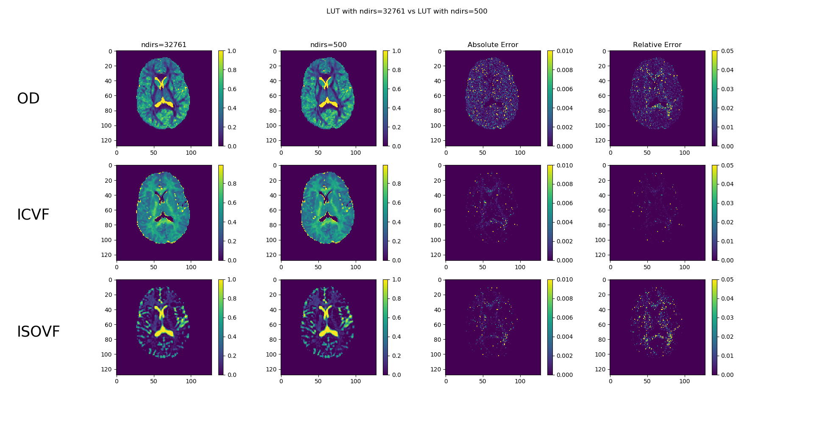

# Angular resolution of the look-up tables
This tutorial illustrates how to __change the resolution of the look-up tables (a.k.a. LUT)__ that is internally used by AMICO to discretize the possible orientations of the fiber populations in each voxel.

## Change the resolution
In order to change the resolution of the LUT internally used by AMICO, we can specify the desired number of directions using the parameter `ndirs` of the `generate_kernels()` method.

For example, if we want to instruct AMICO to use only __32761 directions__ (over the half-sphere) to discretize the possible orientations of the fiber populations in each voxel, we sh. The modified code should be like this:
```Python
>>> import amico

>>> amico.setup()
>>> ae = amico.Evaluation()

>>> ... # Load data and set model

>>> ae.generate_kernels(ndirs=500, regenerate=True)
```
The value of `ndirs` can take one of the following values: {1, 500, 1000, 1500, 2000, 2500, 3000, 3500, 4000, 4500, 5000, 5500, 6000, 6500, 7000, 7500, 8000, 8500, 9000, 9500, 10000, 32761}. Please note that when the value of `ndirs` is not specified, AMICO will use `500` directions by default.

## Differences between the two reconstructions
### Memory consumption
The following table shows the differences in memory of the LUT.

| __ndirs value__ | __memory usage__ |
|:-:|:-:|
| 500 | 50  Megabytes |
| 1000 | 100  Megabytes |
| 1500 | 150  Megabytes |
| 2000 | 200  Megabytes |
| 2500 | 250  Megabytes |
| 3000 | 300  Megabytes |
| 3500 | 350  Megabytes |
| 4000 | 400  Megabytes |
| 4500 | 450  Megabytes |
| 5000 | 500  Megabytes |
| 5500 | 550  Megabytes |
| 6000 | 600  Megabytes |
| 6500 | 650  Megabytes |
| 7000 | 700  Megabytes |
| 7500 | 750  Megabytes |
| 8000 | 800  Megabytes |
| 8500 | 850  Megabytes |
| 9000 | 900  Megabytes |
| 9500 | 950  Megabytes |
| 10000 | 1  Gigabytes |
| 32761 | 3.2  Gigabytes |

### Quality of the fit
A change in the resolution affects the fitting process. The following figure illustrates the differences in the fitting between `ndirs=500` and `ndirs=32761`.

